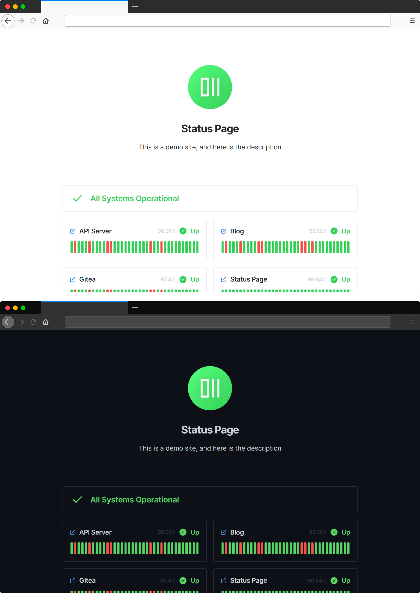

  

<h1 align="center">Status Page</h1>

A status page based on UptimeRobot API

English | <a href="README.zh-CN.md">中文</a>

- [Introduction](#introduction)
- [Demo](#demo)
- [Deployment](#deployment)
- [Documentation](#documentation)
- [Screenshot](#screenshot)
- [License](#license)

## Introduction

This is a status monitoring page based on UptimeRobot API.

You can generate your own status monitoring page by modifying the `config.ts` file in the project root directory.

Inspired by [yb/uptime-status](https://github.com/yb/uptime-status), you can also try this project.

## Demo

See [https://status-page.dev.lifeni.life](https://status-page.dev.lifeni.life).

## Deployment

Click the button below to deploy to [Vercel](https://vercel.com).

You need to configure [the Key of UptimeRobot](https://uptimerobot.com/dashboard.php#mySettings) in environment variables.

  
Expand to view environment variables

| Name                 | Description                                                                  | Default                                   | Type                |
| -------------------- | ---------------------------------------------------------------------------- | ----------------------------------------- | ------------------- |
| `KEY`                | [Your UptimeRobot API Key](https://uptimerobot.com/dashboard.php#mySettings) | -                                         | UptimeRobot API Key |
| `FAVICON`            | Page favicon                                                                 | `/favicon.ico`                            | URL                 |
| `PAGE_TITLE`         | Page title, in `<head>`                                                      | `Status Page`                             | Text                |
| `PAGE_DESC`          | Page description, in `<head>`                                                | `A status page based on UptimeRobot API.` | Text                |
| `THEME`              | Page theme style                                                             | `light`                                   | `dark` or `light`   |
| `SHOW_HEADER_TEXT`   | Whether to display the text in the middle of the page                        | `true`                                    | Boolean             |
| `HEADER_TEXT`        | Text in the middle of the page                                               | `Status Page`                             | Text                |
| `SHOW_HEADER_LOGO`   | Whether to display the Logo in the middle of the page                        | `true`                                    | Boolean             |
| `HEADER_LOGO`        | Logo in the middle of the page                                               | `/logo.svg`                               | URL                 |
| `SHOW_HEADER`        | Whether to display header                                                    | `true`                                    | Boolean             |
| `SHOW_GLOBAL_STATUS` | Whether to display global status bar                                         | `true`                                    | Boolean             |
| `SHOW_FOOTER`        | Whether to display footer                                                    | `true`                                    | Boolean             |

## Documentation

For more documentation, see [Home · Lifeni/status-page Wiki](https://github.com/Lifeni/status-page/wiki).

## Screenshot

## License

MIT License
