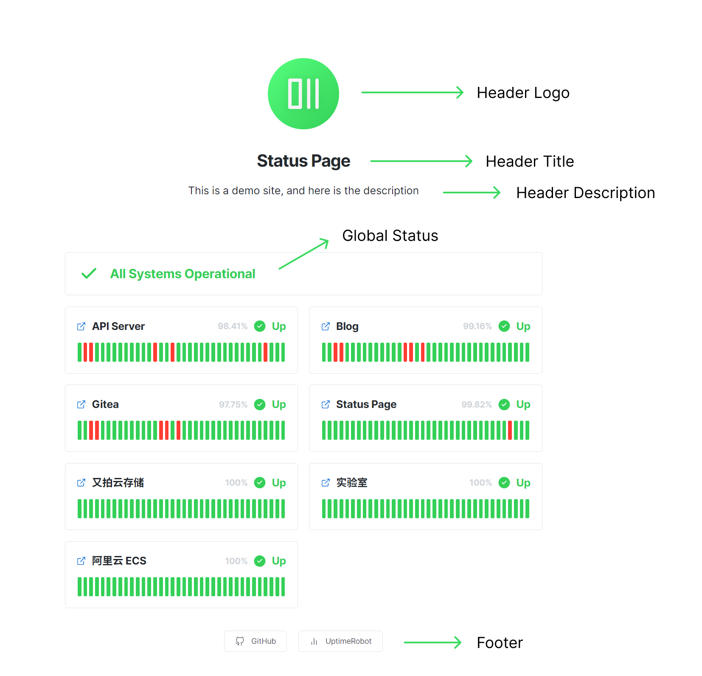

  

<h1 align="center">Status Page</h1>

一个基于 UptimeRobot API 的状态监控页面

<a href="README.md">English</a> | 中文

## 介绍

这是一个基于 UptimeRobot API 的状态监控页面。

可以通过修改项目根目录下的 `config.ts` 文件来生成自己的状态监控页面。

灵感来自于 [yb/uptime-status](https://github.com/yb/uptime-status)，你也可以试试这个项目。

## 演示

演示地址：[https://status-page.dev.lifeni.life](https://status-page.dev.lifeni.life) 。

## 部署

点击下面的按钮部署到 [Vercel](https://vercel.com) 。

你需要在环境变量中配置 [UptimeRobot 的 Key](https://uptimerobot.com/dashboard.php#mySettings) 。

  
展开查看环境变量

 

| 变量名               | 描述                                                                         | 默认值                                             | 类型                |
| -------------------- | ---------------------------------------------------------------------------- | -------------------------------------------------- | ------------------- |
| `KEY`                | [你的 UptimeRobot API Key](https://uptimerobot.com/dashboard.php#mySettings) | -                                                  | UptimeRobot API Key |
| `FAVICON`            | 页面图标                                                                     | `/favicon.ico`                                     | URL                 |
| `PAGE_TITLE`         | 页面标题，在 `<head>` 标签中                                                 | `Status Page`                                      | Text                |
| `PAGE_DESC`          | 页面描述，在 `<head>` 标签中                                                 | `A status page based on UptimeRobot API.`          | Text                |
| `THEME`              | 页面主题样式                                                                 | `light`                                            | `dark` or `light`   |
| `CONTRAST`           | 页面颜色对比度                                                               | `normal`                                           | `normal` or `high`  |
| `SHOW_HEADER_TITLE`  | 是否显示页面中间的标题                                                       | `true`                                             | Boolean             |
| `HEADER_TITLE`       | 页面中间的标题的内容                                                         | `Status Page`                                      | Text                |
| `SHOW_HEADER_DESC`   | 是否显示页面中间的描述                                                       | `true`                                             | Boolean             |
| `HEADER_DESC`        | 页面中间的描述的内容                                                         | `This is a demo site, and here is the description` | Text                |
| `SHOW_HEADER_LOGO`   | 是否显示页面中间的 Logo                                                      | `true`                                             | Boolean             |
| `HEADER_LOGO`        | 页面中间的 Logo                                                              | `/logo.svg`                                        | URL                 |
| `SHOW_HEADER`        | 是否显示 Header                                                              | `true`                                             | Boolean             |
| `SHOW_GLOBAL_STATUS` | 是否显示全局的状态栏                                                         | `true`                                             | Boolean             |
| `SHOW_FOOTER`        | 是否显示 Footer                                                              | `true`                                             | Boolean             |

也可以参考 [.env.example](/.env.example) 。

 

## 文档

更多文档参见：[Home · Lifeni/status-page Wiki](https://github.com/Lifeni/status-page/wiki) 。

## 截图

## 开源协议

MIT License
